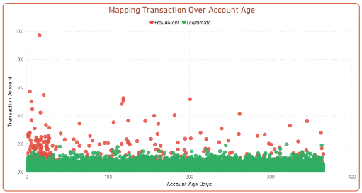

# Fraud Detection in E-Commerce Transactions

> **Goal:** Identify key risk factors and recommend strategies to prevent fraudulent transactions in an e-commerce platform.

---

## Executive Summary
- **5.17%** of transactions were confirmed fraudulent — small in percentage but **financially significant**.  
- **High-value transactions (> $3K)** and **new accounts (<30 days)** were the strongest risk indicators.  
- **Clothing + Bank Transfer** combination showed the **highest fraud rate**.  
- Fraud peaks on **Mondays, Fridays**, and during **late-night hours**.

 **Business Impact:**
- Minimized chargeback losses  
- Improved customer trust and transaction security  
- Strengthened data-driven fraud prevention strategy

---

## Project Overview

| Category | Details |
|-----------|----------|
| **Type** | Data Analytics & Fraud Detection |
| **Tools** | Python (Pandas), Power BI |
| **Dataset** | [Kaggle Fraudulent E-Commerce Transactions](https://www.kaggle.com/datasets/shriyashjagtap/fraudulent-e-commerce-transactions) |
| **Records** | 23,634 transactions |

---

## Analysis Highlights

### - High-Risk Profiles
- **New accounts (<30 days)** have higher fraud rates.
- **Large transactions (> $3K)** are highly suspicious.  
 *Action:* Set stricter transaction limits for new accounts.

### - Product & Payment Risks
- Highest fraud in **Clothing** and **Home & Garden**.  
- **Bank Transfer** and **PayPal** are most vulnerable payment types.  
 *Action:* Apply two-step authentication for these methods.

### - Temporal Patterns
- Fraud spikes during **late-night** and **afternoon** hours, mainly on **Mondays & Fridays**.  
 *Action:* Strengthen real-time monitoring during these periods.

---

## Recommendations

-  Develop a **predictive fraud model** (Random Forest/XGBoost) using risk features.  
-  Enforce **transaction caps** and verification for new users.  
-  Encourage **safer payment methods** like escrow services.  
-  Implement **time-based risk scoring** in detection systems.

---

## 📊 Dashboard Preview

| Fraud Overview | High Risk Segments |
|----------------|-------------------|
|  |  |

📎 [View Full Dashboard (Power BI)](https://drive.google.com/file/d/1r5SSNW7zQrz4wkBE9jAaEeG7k8Y3BZnG/view?usp=sharing)

---

## Key Takeaway
> Fraud detection isn’t about catching criminals — it’s about **understanding behavior and reducing risk**.  
> Through this project, I combined **data storytelling**, **risk analysis**, and **business insight** to create a practical fraud prevention strategy.

