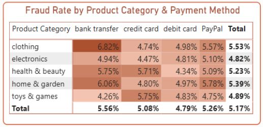

# Fraud Detection in E-Commerce Transactions

## Executive Summary
This project aims to identify key risk factors and recommend strategies to prevent fraudulent transactions in an e-commerce platform.

- **5.17%** of transactions were confirmed fraudulent — small in percentage but **financially significant**.  
- **High-value transactions (> $3K)** and **new accounts (<30 days)** were the strongest risk indicators.  
- **Clothing + Bank Transfer** combination showed the **highest fraud rate**.  
- Fraud peaks on **Mondays, Fridays**, and during **late-night hours**.

 **Business Impact:**
- Minimized chargeback losses  
- Improved customer trust and transaction security  
- Strengthened data-driven fraud prevention strategy

---

## Project Overview

| Category | Details |
|-----------|----------|
| **Type** | Data Analytics & Fraud Detection |
| **Tools** | Python (Pandas), Power BI |
| **Dataset** | [Kaggle Fraudulent E-Commerce Transactions](https://www.kaggle.com/datasets/shriyashjagtap/fraudulent-e-commerce-transactions) |
| **Records** | 23,634 transactions |

## Skills Demonstrated
- **Data Preparation & Cleaning:** handled unreasonable value, standardized data, encoded variables.  
- **Exploratory Data Analysis (EDA):** identified fraud patterns by time, category, and transaction type.  
- **Data Visualization:** built interactive Power BI dashboard to communicate business insights.  
- **Business Insight & Recommendation:** translated analytical findings into actionable fraud prevention strategies.

---

## Analysis Highlights

### High-Risk Profiles

- **New accounts (<30 days)** have higher fraud possibilities.
- **Large transactions (> $3K)** are highly suspicious.  
 *Action:* Set stricter transaction limits for new accounts.

### Fraud by Product & Payment 

- Highest fraud in **Clothing** and **Home & Garden**.  
- **Bank Transfer** is the most vulnerable payment types.  
 *Action:* Apply two-step authentication for Bank Transfer payment method.

### Temporal Patterns

  
  

- Fraud spikes during **late-night** and **afternoon** hours, mainly on **Mondays & Fridays**.  
 *Action:* Strengthen real-time monitoring during these periods.

---

## Recommendations

-  Develop a **predictive fraud model** (Random Forest/XGBoost) using risk features.  
-  Enforce **transaction caps** and verification for new users.  
-  Encourage **safer payment methods** like escrow services.  
-  Implement **time-based risk scoring** in detection systems.

---

## 📊 Dashboard Preview

📎 [Download Interactive Dashboard (Power BI)]([Dashboard/Fraud Transaction Analysis.pbix](https://github.com/sna-ds/Fraudulent-Transaction-Analysis-in-E-Commerce/raw/refs/heads/main/Dashboard/Fraud%20Transaction%20Analysis.pbix))

